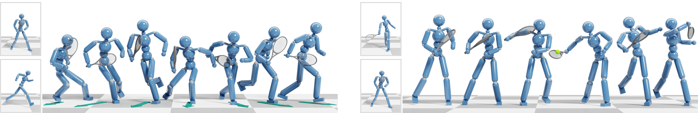
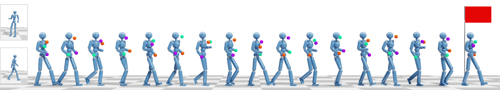
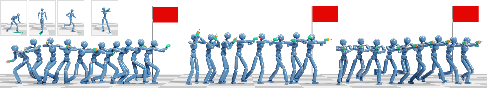

# Composite Motion Learning and Task Control

This is the official implementation for

- _*Composite Motion Learning and Task Control*_
[[arXiv](https://arxiv.org/abs/2305.03286)]
[[Youtube](https://youtu.be/mcRAxwoTh3E)]
(SIGGRAPH'23, [TOG](https://dl.acm.org/doi/abs/10.1145/3592447))

- _*A GAN-Like Approach for Physics-Based Imitation Learning and Interactive Character Control*_
[[arXiv](https://arxiv.org/abs/2105.10066)]
[[Youtube](https://www.youtube.com/watch?v=VHMyvDD3B_o)]
(SCA'21, [PACMCGIT](https://dl.acm.org/doi/abs/10.1145/3480148))

## Code Usage

### Dependencies
- Pytorch 1.12
- IsaacGym Pr4

We recommend to install all the requirements through Conda by

    $ conda create --name <env> --file requirements.txt -c pytorch -c conda-forge

Download IsaacGym Pr4 from the [official site](https://developer.nvidia.com/isaac-gym) and install it via pip.

### Policy Training

    $ python main.py <configure_file> --ckpt <checkpoint_dir>

We provide our configure files in `config` folder for reference. To reproduce the examples shown in the paper, e.g. `Aiming+Crouch`, please run the training by

    $ python main.py config/aim+locomotion_crouch.py --ckpt ckpt_aim+crouch

The training results (model and log) will be generated in the `ckpt_aim+crouch` folder.

The training can be done on a single GPU. Use `--device` option to specify the device used for training (default: 0). All our results were obtained using machines equipped with Nvidia V100 or A100 GPU. 

### Policy Evaluation

    $ python main.py <configure_file> --ckpt <checkpoint_dir> --test

We provide pretrained policy models in `pretrained` folder. To evaluate a pretrained policy, e.g. `Aiming+Crouch`, please run

    $ python main.py config/aim+locomotion_crouch.py --ckpt pretrained/aim+locomotion_crouch --test

## Motion Data Copyright
We provide our motion data in `assets/motions`. 

The data labeled with `lafan1` are extracted from [Ubisoft LAFAN1 dataset](https://github.com/ubisoft/ubisoft-laforge-animation-dataset).
The juggling motion is extracted from the demo provided by [FreeMoCap Project](https://github.com/freemocap/freemocap).
We cannot provide the tennis motions shown in the paper due to the commercial license.

## Citation

If you use the code or provided motions for your work, please consider citing our papers:

    @article{composite,
        author = {Xu, Pei and Shang, Xiumin and Zordan, Victor and Karamouzas, Ioannis},
        title = {Composite Motion Learning with Task Control},
        journal = {ACM Transactions on Graphics},
        publisher = {ACM New York, NY, USA},
        year = {2023},
        volume = {42},
        number = {4},
        doi = {10.1145/3592447},
        keywords = {physics-based control, character animation, motion synthesis, reinforcement learning, multi-objective learning, incremental learning, GAN}
    }

    @article{iccgan,
        author = {Xu, Pei and Karamouzas, Ioannis},
        title = {A GAN-Like Approach for Physics-Based Imitation Learning and Interactive Character Control},
        journal = {Proceedings of the ACM on Computer Graphics and Interactive Techniques},
        publisher = {ACM New York, NY, USA},
        year = {2021},
        volume = {4},
        number = {3},
        pages = {1--22},
        doi = {10.1145/3480148},
        keywords = {physics-based control, character animation, reinforcement learning, GAN}
    }
    
